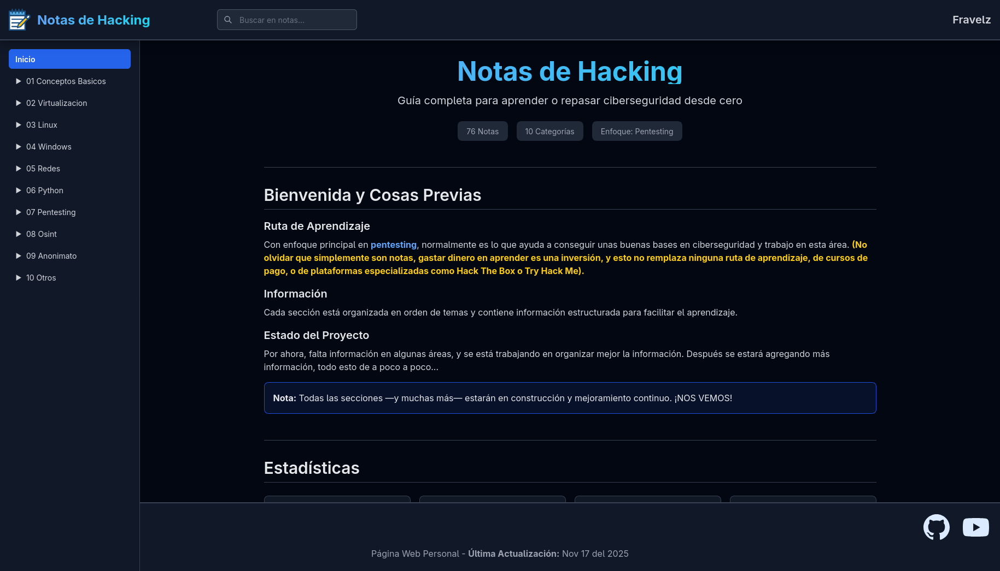

# Notas de Hacking

[English Version](./README.EN.md)



Guía completa para aprender o repasar ciberseguridad desde cero. Un sitio web estático construido con Astro que contiene notas organizadas sobre hacking ético, pentesting, Linux, Python, redes y más.

## ✨ Características

- 📖 **Contenido organizado**: Notas estructuradas por categorías y temas
- 🔍 **Búsqueda avanzada**: Busca en títulos y contenido completo de todas las notas
- 📑 **Índice dinámico**: Tabla de contenidos generada automáticamente para cada página
- 🎨 **Interfaz moderna**: Diseño oscuro con navegación intuitiva
- 📱 **Responsive**: Adaptado para dispositivos móviles y desktop
- ⚡ **Rápido**: Sitio estático optimizado con Astro

## 🛠️ Tecnologías

- **[Astro](https://astro.build/)** - Framework web moderno
- **[React](https://react.dev/)** - Componentes interactivos
- **[MDX](https://mdxjs.com/)** - Markdown con componentes
- **[Tailwind CSS](https://tailwindcss.com/)** - Estilos utilitarios
- **[TypeScript](https://www.typescriptlang.org/)** - Tipado estático
- **[Content Collections](https://docs.astro.build/en/guides/content-collections/)** - Gestión de contenido

## �📁 Estructura del Proyecto

(Aproximación...).

``` text
├── src/
│   ├── components/        # Componentes reutilizables
│   │   ├── layout/        # Header, Sidebar, Footer, TableOfContents
│   │   ├── atomos/        # Componentes básicos
│   │   ├── moleculas/     # Componentes compuestos
│   │   └── organismos/    # Componentes complejos
│   ├── content/
│   │   └── secciones/     # Contenido Markdown/MDX organizado por categorías
│   ├── layouts/           # Layouts principales
│   ├── pages/             # Páginas del sitio
│   └── styles/            # Estilos globales
├── public/                # Archivos estáticos
└── astro.config.mjs       # Configuración de Astro
```

## 🎯 Categorías de Contenido

- **Conceptos Básicos** - Fundamentos de ciberseguridad
- **Linux** - Comandos, scripts y administración
- **Python** - Programación y módulos útiles
- **Redes** - Teoría y herramientas de redes
- **Windows** - PowerShell y administración Windows
- **Pentesting** - Fases y metodologías
- **OSINT** - Inteligencia de fuentes abiertas
- **Anonimato** - Privacidad y anonimato
- **Otros** - Recursos y herramientas adicionales

## 📝 Información

**Licencia:** Apache Licence 2.0

**Fravelz**

- GitHub: [@fravelz](https://github.com/fravelz)

## 🙏 Contribuciones

Las contribuciones son bienvenidas. Si encuentras errores o tienes sugerencias, no dudes en abrir un issue o pull request.

---

⭐ Si este proyecto te resulta útil, considera darle una estrella en GitHub.
